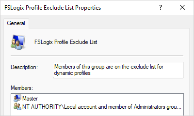
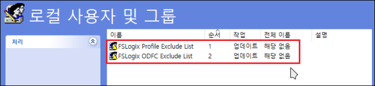
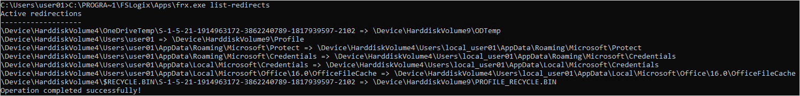

# FSLogix 설치 및 구성
참고 자료
- [프로필 컨테이너 구성](https://learn.microsoft.com/ko-kr/fslogix/tutorial-configure-profile-containers)

# 설치 파일 다운로드
http://aka.ms/fslogix_download 에서 파일 다운로드하여 압축을 풀면 설치 파일 및 그룹 정책 템플릿이 들어있음(`fslogix.adml`와 `fslogix.admx` 파일).

가능한 <u>로컬 그룹 정책으로 먼저 테스트</u> 할 것을 권장.

로컬 테스트의 경우 각 파일을 다음 경로로 옮겨줄 것
- `C:\Windows\PolicyDefinitions\fslogix.admx`
- `C:\Windows\PolicyDefinitions\<MUIculture>\fslogix.adml`

만약 AD서버에 정책 템플릿을 사용한다면 다음 경로에 넣을 것(ADMX 템플릿 중앙 저장소에 추가)
- `\\<도메인이름>\SYSVOL\<도메인이름>\Policies\PolicyDefinitions\fslogix.admx`
- `\\<도메인이름>\SYSVOL\<도메인이름>\Policies\PolicyDefinitions\<MUIculture>\fslogix.adml`
- `<MUIculture>`는 en-US, ko-KR 등의 Locales를 의미

# 정책 예외 처리
> 작업 전 무조건 적용할 것을 권장, 설정의 문제가 있을 경우 관리자 계정으로 복구가 가능하기 때문

FSLogix 에이전트가 설치되면 로컬에 프로필 컨테이너와 Office 컨테이너 관련된 4개의 그룹이 생성됨.
 * FSLogix ODFC Exclude List
 * FSLogix ODFC Include List
 * FSLogix Profile Exclude List
 * FSLogix Profile Include List

이 그룹 중 "Exclude List" 그룹에 포함된 사용자는 FSLogix 설정을 적용받지 않는다(**Exclude List 그룹이 Include List보다 우선 적용**).

> 즉, 로컬 관리자와 같은 계정을 FSLogix 정책 처리에서 예외시키려면 `FSLogix Profile Exclude List` 그룹에 예외 처리할 사용자를 넣으면 됨.

프로덕션 환경에서는 그룹 정책의 **로컬 사용자 및 그룹**을 이용하여 "Domain Admins" 그룹 추가를 권장.
 - 동작: 업데이트
 - 그룹 이름: FSLogix Profile Exclude List 및 FSLogix ODFC Exclude List로 2개 만들 것
 - [추가]를 클릭하여 "Domain Admins" 그룹 입력 후 [이름 확인]

# 그룹 정책 설정 ([참고URL](https://learn.microsoft.com/ko-kr/fslogix/how-to-use-group-policy-templates "FSLogix 그룹 정책 템플릿 파일 사용"))
그룹 정책 관리(로컬은 `gpedit.msc` 도메인 컨트롤러의 경우 `gpmc.msc`)로 들어가서 다음과 같은 정책을 설정.

## **권장 설정 종합**
Computer Configuration > Administrative Templates
 **경로**                                                  | **설정 이름**                              | **상태** | **값**
-----------------------------------------------------------|--------------------------------------------|---------|-----------------------------------------------------------------
 FSLogix/Profile Containers                                | Delete Local Profile When VHD Should Apply | 사용     | "Delete Local Profile When VHD Should Apply" 체크 박스 선택
 FSLogix/Profile Containers                                | Enabled                                    | 사용     | "Enabled" 체크 박스 선택
 FSLogix/Profile Containers                                | Size In MBs                                | 사용     | 최소 500MB (기본값 30GB = 30,000)
 FSLogix/Profile Containers                                | VHD Locations                              | 사용     | 공유 이름 지정(예: `\\ctxvdat01kc.file.core.windows.net\uplfolder`)
 FSLogix/Profile Containers/Advanced                       | Locked Retry Count                         | 사용     | 3
 FSLogix/Profile Containers/Advanced                       | Locked Retry Interval                      | 사용     | 15
 FSLogix/Profile Containers/Advanced                       | Prevent Login With Failure                 | 사용     | "Prevent Login With Failure" 체크 박스 선택
 FSLogix/Profile Containers/Advanced                       | Prevent Login With Temp Profile            | 사용     | "Prevent Login With Temp Profile" 체크 박스 선택
 FSLogix/Profile Containers/Advanced                       | Reattach Count                             | 사용     | 3
 FSLogix/Profile Containers/Advanced                       | Reattach Interval                          | 사용     | 15
 FSLogix/Profile Containers/Advanced                       | Redirection XML Source Folder              | 사용     | XML 파일이 위치한 경로 지정(예: `\\ctxvdat01kc.file.core.windows.net\uplfolder`)
 FSLogix/Profile Containers/Container and Directory Naming | Flip Flop Profile Directory Name           | 사용     | "Flip Flop Profile Directory Name" 체크 박스 선택

추가로 redirections.xml을 만들어서 일부 디렉터리를 컨테이너에서 제외시켜야 함. 컨테이너에 생긴 디렉터리는 나중에 예외 처리해도 제거되지 않음.

상세 정책 설명은 [MS 문서](https://learn.microsoft.com/ko-kr/fslogix/reference-configuration-settings "구성 설정") 참고

## MS 권장 설정 참고용
키 이름                               | 데이터 형식 |   값  | 설명
--------------------------------------|-------------|-------|---------
**Enabled**                              | DWORD       | 1     | 필수
DeleteLocalProfileWhenVHDShouldApply[1](#fn1) | DWORD | 1 | 권장
FlipFlopProfileDirectoryName[2](#fn2) | DWORD | 1 | 권장
LockedRetryCount[3](#fn3) | DWORD | 3 | 권장
LockedRetryInterval[3](#fn3) | DWORD | 15 | 권장
ProfileType[4](#fn4) | DWORD | 0 | 기본값
ReAttachIntervalSeconds[3](#fn3) | DWORD | 15 | 권장
ReAttachRetryCount[3](#fn3) | DWORD | 3 | 권장
SizeInMBs | DWORD | 30000 | 기본값
VHDLocations | **MULTI_SZ 또는 REG_SZ** | `\\<storage-account-name>.file.core.windows.net\<share-name>` | 예제
VolumeType[5](#fn5) | REG_SZ | VHDX | 권장

<b id="fn1">1</b> 사용자가 로컬 프로필을 사용하지 않고 예기치 않게 데이터가 손실되지 않도록 하는 것이 좋습니다.  
<b id="fn2">2</b> 컨테이너 디렉터리를 보다 쉽게 찾아볼 수 있는 방법을 제공합니다.  
<b id="fn3">3</b> 재시도 타이밍을 줄여 더 빠른 실패 시나리오를 활성화합니다.  
<b id="fn4">4</b> 단일 연결은 복잡성을 줄이고 성능을 향상시킵니다.  
<b id="fn5">5</b> VHDX는 지원되는 크기와 손상 시나리오 감소로 인해 VHD보다 선호됩니다. [↩](#a5)

# 사용자 지정 프로필 리디렉션 설정
- 기본적으로 redirections.xml 파일을 제공하지 않음.
- 구성 시 컨테이너 내에 파일 또는 폴더를 포함/제외시킬 수 있음
- 구성 방법은 다음 링크들을 참고
    - [Tutorial: Create and Implement redirections.xml - FSLogix | Microsoft Learn](https://learn.microsoft.com/en-us/fslogix/tutorial-redirections-xml)
    - [Custom profile redirections.xml - FSLogix | Microsoft Learn](https://learn.microsoft.com/en-us/fslogix/concepts-redirections-xml)
    - [Crowd Sourced Redirections.xml for FSLogix Profile Containers | Aaron Parker (stealthpuppy.com)](https://stealthpuppy.com/fslogix-profile-containers-redirections/)
- 예제 파일 참고: [redirections.xml](FSLogix/redirections.xml)

## 설정 확인 명령어
`C:\PROGRA~1\FSLogix\Apps\frx.exe list-redirects`

# Tips
 - 컨테이너 갱신 시점은 사용자가 로그인/로그아웃 시(로밍 프로필과 동일)
 - 사용자가 로그인 되어 컨테이너가 마운트 됐을 땐 <컨테이너명.vhd>.metadata 파일이 생성되며 로그아웃 시 삭제됨
 - Cloud Cache는 로컬 캐시를 제공하여 사용자가 스토리지에 액세스 안될 때도 로컬 프로필로 사용할 수 있는 기능이며 또한 사용자가 여러 원격 위치에서 액세스 할 수 있다고 함(사용자 세션 중에 지속적으로 업데이트 됨).
 - 따라서 Cloud Cache는 Active-Active 구현 시에 유용한 기술
 - 하지만 Cloud Cache의 중요한 주의 사항으로 일반적으로 초기 로그인 시 컨테이너를 사용하는 것 만큼 로그온 속도를 향상시키지 못함. VM이 초기화되지 않는다면 초기 연결 후에는 괜찮다고 함.

## 참고할만한 URL
 - [FSLogix - 구성 예제](https://learn.microsoft.com/en-us/fslogix/concepts-configuration-examples)
 - [FSLogix: An In-Depth Look](https://bluexp.netapp.com/blog/azure-anf-blg-fslogix-an-in-depth-look)
 - [Citrix UPM and FSLogix Containers](https://jkindon.com/citrix-upm-and-fslogix-containers/)
